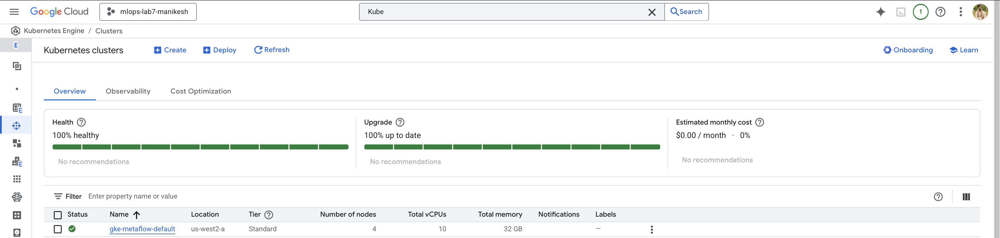
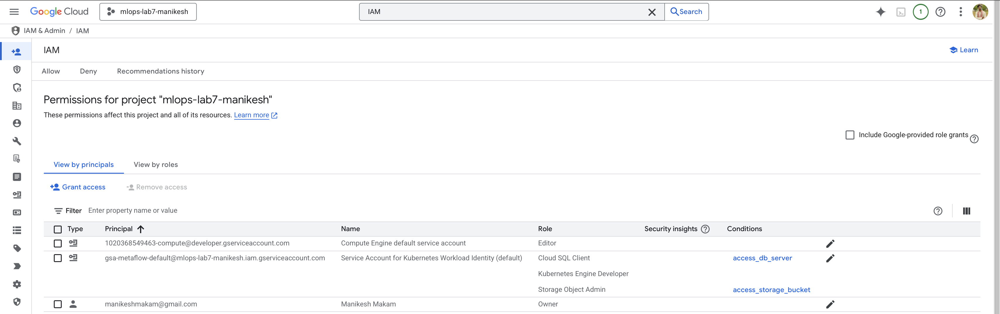
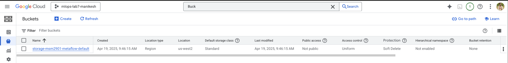

# Installations

## Terraform
[Link](https://developer.hashicorp.com/terraform/tutorials/aws-get-started/install-cli)
```bash
brew tap hashicorp/tap
brew install hashicorp/tap/terraform
brew update
brew upgrade hashicorp/tap/terraform
```

### Verify
`terraform -help`

## GCP CLI
- Download .tar file from [Link](https://cloud.google.com/sdk/docs/install-sdk) into root directory
```bash
./google-cloud-sdk/install.sh
```
- there mostly will be errors regarding path. ChatGPT it.

## Kubectl
[Link](https://kubernetes.io/docs/tasks/tools/install-kubectl-macos/)
```bash
brew install kubectl
```

### Verify
`kubectl version --client`

## Kubernetes
```bash
pip install kubernetes
```

## Clone Metaflow Tools Repo
```bash
git clone https://github.com/outerbounds/metaflow-tools.git
cd metaflow-tools/gcp/terraform
```
- Delete the folders not required. (ex: aws, azure, nebius)

# GCP Setup
## Initialization
```bash
gcloud init
```
- create a project and save the project name
- on the console link a billing account to the project

## Enabling Services
- Cloud Resource Manager
- Compute Engine API
- Service Networking 
- Cloud SQL Admin API
- Kubernetes Engine API

```bash
gcloud services enable cloudresourcemanager.googleapis.com 
gcloud services enable compute.googleapis.com
gcloud services enable servicenetworking.googleapis.com 
gcloud services enable sqladmin.googleapis.com
gcloud services enable container.googleapis.com
```

# Terraform in GCP
- Login to GCP
```bash
gcloud auth application-default login
```
- Initialize Terraform
```bash
terraform init
```
- Create `metaflow.tfvars` file for variables

```bash
org_prefix = "msm2901"
project = "mlops-lab7-manikesh"
enable_argo = true
```
- Provision GCP infrastructure using Terraform
```bash
terraform apply -target="module.infra" -var-file=metaflow.tfvars
```
- Deploy services using Terraform
```bash
terraform apply -target="module.services" -var-file=metaflow.tfvars
```
# Verify the Infrastructure
## Step 1: Verify Access to GCP Resources
### Kubernetes Cluster
- There should be a cluster named `gke-metaflow-default` with status `RUNNING`
```
search -> Kubeneters Engine
```

- Check IAM role `KE Developer` is in place linked to the service account created.
```
search -> IAM
```


## GCS Bucket
- Check if storage bucket is created.
```
search -> Buckets
```


- Check if `Storage Object Admin` is assigned.
```
click on bucket -> permissions tab -> check in roles
```
## Step 2: KB Configuration
- Configure your local Kubernetes context to point to the the right Kubernetes cluster:
```bash
gcloud container clusters get-credentials gke-metaflow-default --region=us-west2-a
```

## Step 3: Configure Metaflow
- Copy `config.json` to `~/.metaflowconfig/config.json`. Create the folder if not available.
```bash
cp config.json ~/.metaflowconfig/config.json
```
Edit based on requirement
```json
{
    "METAFLOW_ARGO_EVENTS_EVENT":"metaflow-event",
    "METAFLOW_ARGO_EVENTS_EVENT_BUS":"default",
    "METAFLOW_ARGO_EVENTS_EVENT_SOURCE":"argo-events-webhook",
    "METAFLOW_ARGO_EVENTS_SERVICE_ACCOUNT":"operate-workflow-sa",
    "METAFLOW_ARGO_EVENTS_WEBHOOK_URL":"http://argo-events-webhook-eventsource-svc.argo:12000/metaflow-event",
    "METAFLOW_DATASTORE_SYSROOT_GS":"gs://storage-msm2901-metaflow-default/tf-full-stack-sysroot",
    "METAFLOW_DEFAULT_DATASTORE":"gs",
    "METAFLOW_DEFAULT_METADATA":"service",
    "METAFLOW_KUBERNETES_NAMESPACE":"argo",
    "METAFLOW_KUBERNETES_SERVICE_ACCOUNT":"argo",
    "METAFLOW_SERVICE_INTERNAL_URL":"http://metadata-service.default:8080/",
    "METAFLOW_SERVICE_URL":"http://127.0.0.1:8080/"
}
```
## Step 4: Install GKE
```bash
gcloud components install gke-gcloud-auth-plugin
```

## Step 5: Port Forwarding
- option 1 - run kubectl's manually
```bash
kubectl port-forward deployment/metadata-service 8080:8080
kubectl port-forward deployment/metaflow-ui-backend-service 8083:8083
kubectl port-forward deployment/metadata-service 3000:3000
kubectl port-forward -n argo deployment/argo-server 2746:2746
kubectl port-forward -n argo service/argo-events-webhook-eventsource-svc 12000:12000
```

- option 2 - this script manages the same port-forwards for you (and prevents timeouts) (recommended)
```bash
python forward_metaflow_ports.py --include-argo
```

- Press Command + T in terminal to open terminal in same $pwd
- `conda activate mlops`
- check if the gcloud project is correct `gcloud config get-value project`


# Conda Dependencies
- open `~/.zprofile` by using `vim` and add the below line

```bash
export CONDA_CHANNELS=conda-forge
```
- then run in terminal

```bash
source ~/.zprofile
```

# Write code
- write metaflow scripts.
```bash
trainingflowgcp.py
scoringflowgcpd.py
```

# Run Metaflow
Example:
- Using `@conda_base`
```bash
python trainingflowgcp.py --environment=conda run --path ./data/heart-disease
```

- Using `@conda_base` and `@kubernetes`
```bash
python ../../../src/trainingflowgcp.py --with kubernetes --environment=conda run --path gs://storage-mk20042025-metaflow-default/data/heart-disease.csv
```
**NOTE:** while running in kubernetes, it doesn't understand local path, so give a GCS path


